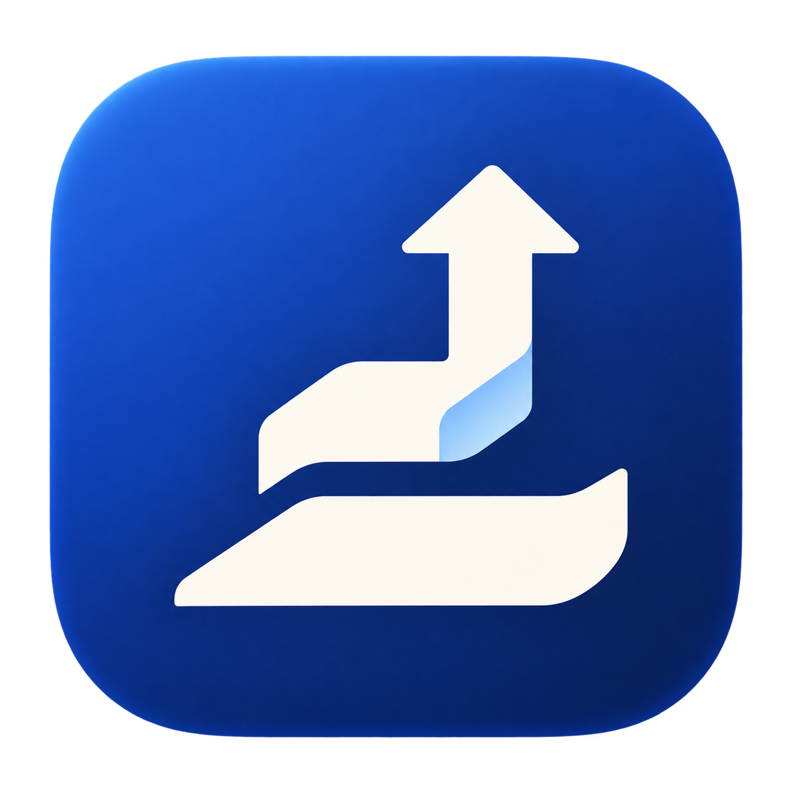

<p align="center"></p>

# 向上 · 人生顾问团 + 成长工作台

**51 个顾问技能，一套属于你的成长工作台。**

用纳瓦尔思考人生方向，用费曼检验学习，用巴菲特审视长期选择，用创作、健身、一人公司的方法解决眼前问题。把这些方法与你自己的经历放在一起，借助 AI 助理想清楚下一步，再用工作台留下行动与复盘。

[一键开始](#一键开始) · [顾问团能帮你什么](#顾问团能帮你什么) · [怎么用](#从一个真实问题开始) · [下载](https://github.com/chenxinan9/upward-workbench/releases/tag/v0.2.1-rc2)

## 一键开始

在终端粘贴这一行，下载顾问团和工作台，自动准备示例并打开浏览器：

```bash
curl -fsSL https://raw.githubusercontent.com/chenxinan9/upward-workbench/main/install.sh | bash
```

需要 **macOS 或 Linux、Python 3.11+**。安装过程会检查环境、校验下载包，不覆盖已有资料。先体验顾问阅读、目标管理与记录；需要 AI 讨论时，再连接已登录的 Codex CLI。AI 调用使用你自己的账号与额度。

这条命令启动本机浏览器版，包含 51 份顾问缩编和虚构示例。macOS 桌面图标、手动安装与故障排查见[安装说明](docs/getting-started.md)。

<details>
<summary>只想把顾问团装进 Codex？</summary>

在一个新的项目文件夹运行下面一行，安装 51 份顾问技能（需要 Node.js 22.20+）：

```bash
npx --yes skills@1.7.0 add https://github.com/chenxinan9/upward-workbench/tree/main/advisors-bundle -a codex --skill '*' --copy -y
```

技能安装在当前项目中，开启新的 Codex 对话后使用。这条命令只安装顾问技能；需要完整工作台时使用上方的一键体验。

</details>

## 顾问团能帮你什么

带着问题选顾问，一次用一两种相关方法就可以。

| 你正在想的事 | 可以借助的顾问与方法 |
| --- | --- |
| 我想过怎样的生活，精力应该投向哪里？ | 纳瓦尔、阿德勒、弗兰克尔、庄子 |
| 学 AI 总在收藏，怎样真正学会？ | 费曼、Karpathy、个人 AI 学习、英语学习 |
| 想做自媒体或一人公司，从哪里验证？ | MrBeast、Dan Koe、Paul Graham、一人公司策略与增长 |
| 一个选择值不值得长期投入？ | 巴菲特、芒格、塔勒布、收支预算与大额消费 |
| 工作中怎样沟通、管理与推进？ | 德鲁克、格鲁夫、冯唐、职场沟通与冲突处理 |
| 计划很多却动不起来，怎么办？ | James Clear、WOOP、王阳明、曾国藩 |
| 想练身体、调整作息，怎样开始？ | 健身训练、睡眠习惯、压力管理、就医准备 |
| 怎样看清矛盾，重新审视自己的判断？ | 《实践论》与《矛盾论》方法、苏格拉底、亚里士多德、老子 |

顾问以社区整理、经许可缩编的 **Skill 方法文件**提供，供 AI 阅读和参考。人物视角不代表本人参与或授权；健康、投资等重要决定仍需核对现实条件。[查看全部 51 份顾问与来源 →](docs/advisors.md)

## 从一个真实问题开始

例如，你可以这样问：

> 我想做自媒体，但每周只有六小时。请结合我提供的经历，用 Dan Koe 和一人公司策略的方法，帮我选一个可以小规模验证的方向，并拆出本周第一步。

在工作台选入相关顾问与自己的资料，预览后发给 AI 助理；从回复中采用适合自己的目标，再记录实际结果。

**了解自己 → 借助顾问思考 → 决定下一步 → 行动 → 复盘入库。**

工作台把这个过程放在一起：

- **人生全景**：看长期想过的生活与方向。
- **目标与计划**：把方向拆成阶段结果，安排下一步。
- **我的今天**：每天一条顾问提醒，查看当天行动，随手记下想法。
- **顾问书房**：读方法，记自己的理解，关联正在推进的目标。
- **知识库与 AI 协作**：回查自己的记录，带着选定的材料继续讨论。

资料和记录保存在本机；只有确认发送的内容进入当前模型服务。提醒目前为 7 条轮换，工作台仍在预发布阶段。[日常使用指南 →](docs/daily-use.md)

## 自己使用，也可以继续改造

代码、方法和示例开放，你可以换成自己的资料，扩展顾问，调整工作台。示例不含作者个人信息。

[安装与桌面入口](docs/getting-started.md) · [知识库接入](docs/integration.md) · [运行与维护](docs/reference.md) · [路线图](ROADMAP.md) · [参与贡献](CONTRIBUTING.md)

感谢原作者贡献顾问方法。原创代码采用 [MIT](LICENSE)，第三方 Skill 保留各自许可与来源；55 条来源中有 4 条因许可限制未分发正文，公开可读的是上述 51 份。[来源与许可](advisors-bundle/README.md) · [隐私与安全](SECURITY.md)
