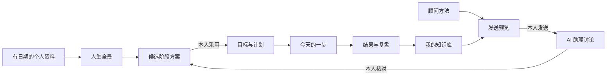

# 运行、接入与维护参考

本页面向需要手动运行、配置和维护的人。快速体验见[项目首页](../README.md)。

把想过的生活、阶段计划和今天的一步分开管理，再用顾问方法、AI 助理与自己的记录帮助判断。向上工作台在本机运行，使用 Python 标准库、SQLite 和原生网页；无需安装 npm 依赖。

公开包提供可运行的工作台、51 份顾问缩编 Skill 和可回读的合成示例。它不含原作者的个人画像、真实目标、原始资料库、私人对话或宣传创作资料。以下步骤使用虚构的“摄影与英语练习”材料，可以先体验，再替换成自己的内容。

## 三个页面，各有用途

| 页面 | 回答的问题 | 保留的内容 |
| --- | --- | --- |
| 我的今天 | 今天先做什么？ | 每日顾问提醒、已到期行动、未排期提醒、一个学习入口、随手记 |
| 人生全景 | 想过什么样的生活，目前在哪个阶段？ | 有来源的愿望、生活方向、阶段路线、成长方法、历史变化 |
| 目标与计划 | 已决定取得什么阶段结果，怎样安排与验证？ | 已采用目标、步骤、日期、完成依据、候选方案与复盘 |

顾问书房用于阅读方法、留下理解与实践结果；我的知识库用于查找自己的记录与已接入来源。“与 Codex 协作”中的 **AI 助理**帮助分析所选文字材料，由使用者判断和采用建议；人物顾问是方法视角，不是人物本人或授权代言。

## 从可回读的示例开始

需要 Python 3.11 或更新版本。笔记入库还需要 Python 所用 SQLite 支持 FTS5 和 `trigram` tokenizer。命令在项目根目录执行：

```sh
python3 examples/init_demo.py --data-dir "$HOME/UpwardDemoData"
python3 tools/setup_knowledge.py --data-dir "$HOME/UpwardDemoData"
python3 app.py --data-dir "$HOME/UpwardDemoData" --port 60129
```

打开 <http://127.0.0.1:60129>。初始化器要求新的源码外目录，拒绝覆盖现有目录；示例没有默认采用的目标。第一次可依次体验：回读全景原话 → 展开一个候选方案 → 采用并安排一步 → 保存学习理解 → 入库后检索。AI 对话是可选环节。

只想使用空工作台，可跳过示例初始化，直接运行：

```sh
python3 tools/setup_knowledge.py --data-dir "$HOME/UpwardMyData"
python3 app.py --data-dir "$HOME/UpwardMyData" --port 60129
```

空工作台不会替你生成画像或冒用别人的人生全景。也可单独执行 `python3 app.py`，默认地址为 <http://127.0.0.1:60128>，默认数据目录是 `~/.local/share/growth-desk`；未配置索引器时，保存和本机笔记搜索仍可用，统一入库暂不可用。

详细步骤、故障排查和资料格式见 [上手说明](getting-started.md)，日常使用见 [使用指南](daily-use.md)。macOS 独立窗口与桌面入口见 [桌面安装](../desktop/README.md)。公开包提供自己的图标；私人截图中的场景图不分发，没有场景图时使用渐变背景。

## 资料如何流动



个人数据库、配置、来源文件、模型调用记录和知识索引存放在源码目录之外。保存记录与成功入库是两个状态；“已完成”也不等于已经产生预期效果。没有真实依据时不显示人生评分、财富进度或顾问效果百分比。

## 连接 AI 助理

本机安装并登录 Codex CLI 后，先确认 `codex exec --help` 可执行；如果桌面环境找不到 CLI，可在私人 `settings.json` 的 `codex_cli` 字段填入自己的可执行文件绝对路径，再重启服务。账号与模型提供方沿用现有 CLI 配置，项目不要求复制密钥。

发送前会展示本轮问题、所选参考和携带的已完成对话历史。每轮最多选择 4 份参考，各截取前 9,000 字符；勾选后还可附上正在推进的目标。历史最多取最近 12 条已完成消息。只有确认发送才调用 `codex exec --json --ephemeral`，可能产生账号或模型路由用量。

工作台使用自己的本地会话，不恢复桌面端原聊天。当前为纯文字讨论，关闭工具与已配置 MCP，不自动浏览网页、执行计划或改知识库；显示 CLI 完整回复后再由使用者取舍。取消停止本机进程，不表示远端已撤销处理。CLI 版本变化后需要复验配置兼容性；本机程序存在也不等于已经登录或成功调用模型。

## 顾问与方法的数量

| 项目 | 当前数量与口径 |
| --- | --- |
| 顾问来源目录 | 55 条来源，包括人物视角和功能流程，不是 55 位真人导师 |
| 随包可读缩编 Skill | 51 份；不是原仓库或原书全文 |
| 登记的去重方法 | 33 项保留子集，不代表上游全部方法 |
| 项目使用流程 | 8 条，和顾问方法分别统计 |
| 核源提醒 | 7 条首批提醒，区分原话、意译与译文 |
| 总顾问路由入口 | `skills/upward-advisor/`，是额外工作流入口，不计为第 52 位顾问 |

4 条来源因许可未明确、非商业或内部限制而没有分发正文。每个缩编目录保留原许可、固定版本来源及修改说明；本项目 MIT 不覆盖第三方原许可。详见 [顾问包说明](../advisors-bundle/README.md)、[许可审查](advisor-bundle-audit.md)。运行 `python3 tools/metrics.py` 可重新统计公开文件；不能从这些数量推算学习效果、收入或人生改善率。

## 自己的知识库与扩展

`tools/setup_knowledge.py` 为指定数据目录配置随包本地索引器，默认只索引该目录的 `knowledge/` 笔记，不遍历其他个人目录，不自动导入私人材料。已有检索器的接入协议见 [接入说明](integration.md)；有现成完整顾问库时可以单独配置，公开版仍可直接使用随包 51 份缩编。

示例中的 `source_register` 支持原文回读。全文检索另由知识集合决定：文件可回读不意味着已加入搜索。增加自己的集合前，先确定范围和材料权限。

## 检查、备份与贡献

```sh
python3 -m unittest discover -s tests -v
node tests/test_frontend_steps.cjs
python3 tools/metrics.py
```

Node.js 只用于上述前端回归，不是运行工作台的依赖。自动检查通过不替代桌面窗口、窄屏、真实模型回复和入库回读的验收；旧版本审查记录不自动证明本版。停止服务后再备份：

```sh
python3 tools/backup.py backup --data-dir "$HOME/UpwardDemoData" --archive "$HOME/upward-private-backup.zip"
python3 tools/backup.py restore --data-dir "$HOME/UpwardRestored" --archive "$HOME/upward-private-backup.zip"
```

恢复目录须不存在。备份包含私人资料，不上传到公共仓库。源码、顾问许可与自己的资料需要分开管理；版本升级时备份并保留旧运行副本。

- [贡献说明](../CONTRIBUTING.md)：改动范围、合成案例与核验方式。
- [安全说明](../SECURITY.md)：本地运行边界、数据与问题反馈。
- [路线图](../ROADMAP.md)：已有能力、后续候选及尚未支持的场景。

当前提供预发布版；发布和升级前需要重新核对文件与测试。原创代码与原创流程使用 [MIT](../LICENSE)，第三方归属见 [NOTICE](../NOTICE)。
